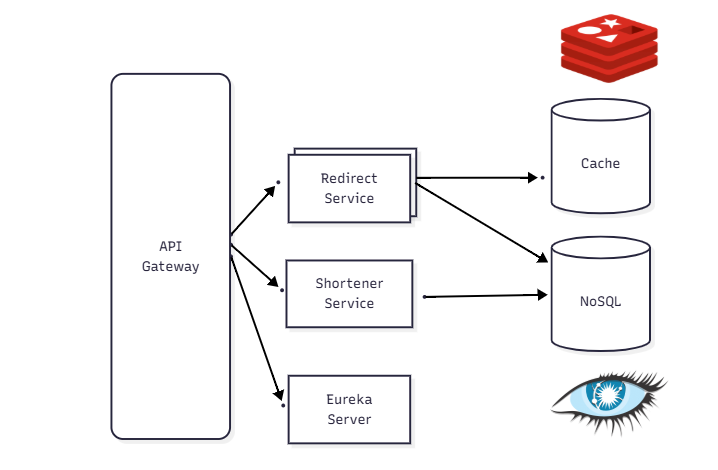

# High-Performance Distributed URL Shortener

A robust and scalable URL shortener built with **Java 25** and **Spring Boot 4**, designed to handle high loads using a microservices architecture. It leverages **Apache Cassandra** for highly availability and **Redis** for ultra-fast read performance.

## Architecture

The system follows a separation of concerns principle, splitting the "Write" (Shortening) and "Read" (Redirect) paths to optimize for different performance characteristics.



## Tech Stack & Features

*   **Java 25** & **Spring Boot 4**: Built on the latest cutting-edge Java ecosystem.
*   **Spring Cloud Gateway**: Acts as the single entry point, handling routing and load balancing.
*   **Netflix Eureka**: Provides dynamic service discovery and registration.
*   **Apache Cassandra**: Distributed NoSQL database chosen for its high availability and write performance.
*   **Redis**: In-memory data store acting as a high-speed cache to ensure low-latency redirects.
*   **Docker Compose**: Fully containerized environment supporting replica scaling.

## Service Details

### 1. URL Shortening Service (Write Path)
*   **Responsibility**: Generates unique short codes for long URLs.
*   **Hashing Algorithm**: Uses **SHA-256** to hash the original URL, followed by **Base62** encoding.
    *   *Why this approach?* SHA-256 ensures a secure and uniform distribution of hash values, reducing collision probabilities. Base62 encoding condenses this hash into a short, URL-friendly alphanumeric string.
*   **Storage**: Persists the `[Short Code] -> [Long URL]` mapping in **Cassandra**.

### 2. URL Redirect Service (Read Path)
*   **Responsibility**: Resolves short codes and redirects users.
*   **Performance Strategy**: Implements a **Read-Through Caching** pattern.
    1.  **Cache Hit**: Checks **Redis** first. If found, returns the URL immediately (sub-millisecond latency).
    2.  **Cache Miss**: If not in Redis, queries **Cassandra**, updates the Redis cache for future requests, and then proceeds.
*   **Scalability**: Stateless service design allows for horizontal scaling (e.g., running multiple instances) to handle read spikes.

### 3. API Gateway & Discovery
*   **Gateway**: Routes requests to the appropriate service (`/url/shorten` -> Shortening Service, `/url/{code}` -> Redirect Service).
*   **Eureka**: Services register themselves upon startup, allowing the Gateway to dynamically discover and load-balance requests.

## Getting Started

### Prerequisites

*   **Docker** installed.
*   **Java 25** (if running locally without Docker).

### Installation & Running

1.  **Clone the repository**:
    ```bash
    git clone <repository-url>
    cd url-shortener
    ```

2.  **Start the infrastructure**:
    Use Docker Compose to spin up the entire stack. We scale the redirect service to 2 instances to demonstrate load balancing:
    ```bash
    docker-compose up --build --scale redirect-service=2
    ```

    **Services started:**
    *   `db-cassandra` (Port 9042)
    *   `url-redis` (Port 6379)
    *   `url-eureka-server` (Port 8761)
    *   `url-gateway-api` (Port 8080)
    *   `redirect-service` (2 instances, internal ports)
    *   `shortening-service` (Port 8090)

3.  **Verify Status**:
    *   Access Eureka Dashboard to see registered services: `http://localhost:8761`

## API Usage

All API requests should be routed through the **API Gateway** at `http://localhost:8080`.

### 1. Shorten a URL
Generates a short code for a provided long URL.

*   **URL**: `/url/shorten`
*   **Method**: `POST`
*   **Content-Type**: `application/json`
*   **Body**:
    ```json
    {
      "url": "https://www.google.com/search?q=spring+boot+microservices"
    }
    ```
*   **Success Response (200 OK)**:
    ```json
    {
      "url": "https://www.google.com/search?q=spring+boot+microservices",
      "shortUrl": "a7B2xGh"
    }
    ```

### 2. Redirect
Access the original URL using the generated short code.

*   **URL**: `/url/{shortCode}`
*   **Method**: `GET`
*   **Example**: `http://localhost:8080/url/a7B2xGh`
*   **Behavior**:
    *   Server responds with `302 Found`.
    *   `Location` header contains the original long URL.
    *   Browser automatically navigates to the destination.
